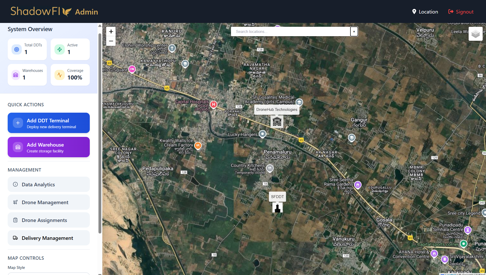

# 🚀 Autonomous Drone Delivery System  
**Internship Project | Organization: DroneHub Technologies Pvt Ltd | Client: ShadowFly**  
**Duration:** 2 Months  
**Tech Stack:** React.js • Python Flask • PostgreSQL • Raspberry Pi (PiTunnel)

---

## 🧭 Project Overview  

The **Autonomous Drone Delivery System** is a full-stack IoT-powered web platform built during an internship at **DroneHub Technologies Pvt Ltd** for the client **ShadowFly**.  
It automates the management of drone-based parcel deliveries, offering **real-time communication** between the **User**, **Admin**, and **DDT (Delivery Drone Terminal)** interfaces.  
Communication between the Raspberry Pi-based DDT terminals and the central backend is achieved via **secure tunnels using PiTunnel**, enabling continuous drone telemetry and control.

---

## 📁 Table of Contents
1. [Admin Dashboard](#-1-admin-dashboard)  
2. [User Page](#-2-user-page)  
3. [DDT Screen](#-3-ddt-delivery-drone-terminal-screen)  
4. [System Workflow](#-system-workflow)  
5. [Real-Time Communication](#-real-time-communication)  
6. [Internship Details](#-internship-details)  
7. [Author](#-author)

---

## 🧩 System Modules

### 🧑‍💼 1. Admin Dashboard

The **Admin Dashboard** serves as the central control hub for drone operations and delivery management.  
It provides real-time visualization, drone telemetry, and delivery tracking through a web interface.

#### 🔹 Key Features:
- **Dashboard Overview:** Drone count, active deliveries, and terminal status.  
- **Live Drone Map:** Real-time tracking of all active drones using Leaflet.js.  
- **Delivery Management:** Assign deliveries to available drones and monitor progress.  
- **DDT Terminal Control:** Connect, manage, or reset Raspberry Pi DDT nodes remotely.  
- **User Analytics:** Overview of registered users and delivery history.  

#### 🖼️ Sample Screenshot:
| Admin Dashboard |
|------------------|
|  |

#### 💻 Tech Stack:
- React.js (frontend)  
- Flask (API + WebSocket backend)  
- PostgreSQL (database)  
- Leaflet.js (map rendering)

---

### 👨‍🦱 2. User Page

The **User Page** allows customers to request deliveries, view package status, and track drones in real-time.  
This interface provides a smooth, responsive experience for interacting with the delivery system.

#### 🔹 Key Features:
- **User Authentication:** Secure signup/login using JWT.  
- **Delivery Request:** Input pickup and destination details.  
- **Live Tracking:** Displays drone’s route and current position on an interactive map.  
- **Package Status:** View detailed updates — *Pending, Dispatched, In-Transit, Delivered*.  
- **Order History:** All past deliveries with time, drone ID, and distance covered.  
- **Feedback Section:** Submit delivery feedback for system improvement.

#### 🖼️ Sample Screenshots:
| User Page | Drone Tracking | Package Tracking |
|------------|----------------|------------------|
|  |  |  |

#### 💻 Tech Stack:
- React.js (frontend)  
- Flask REST API (backend)  
- PostgreSQL (database)  
- Flask-SocketIO (live tracking updates)

---

### 🚁 3. DDT (Delivery Drone Terminal) Screen

The **DDT Screen** is deployed on a **Raspberry Pi**, functioning as an IoT edge device that bridges communication between drones and the cloud backend.  
It ensures stable, secure, and low-latency data transfer via **PiTunnel**.

#### 🔹 Key Features:
- **Telemetry Streaming:** Sends live drone metrics (GPS, battery, altitude, velocity).  
- **Command Execution:** Receives and performs admin-issued commands instantly.  
- **Secure Tunnels:** Maintains continuous communication using PiTunnel even without a public IP.  
- **Auto-Reconnect:** Restores connection automatically after power or network loss.  
- **Optional Local Display:** Shows telemetry and connection info on a Pi screen.

#### 🖼️ Sample Screenshot:
| DDT Screen |
|-------------|
|  |

#### 💻 Tech Stack:
- Raspberry Pi OS  
- Python (Flask SocketIO client)  
- PiTunnel (reverse tunneling)  
- Flask backend (control layer)

---

## ⚙️ System Workflow

1. **User** creates a delivery request via the web app.  
2. **Admin** assigns a drone and sends a mission command.  
3. **DDT Terminal** (Raspberry Pi) receives the command securely through PiTunnel.  
4. **Drone** begins delivery, sending telemetry data to the backend.  
5. **Dashboards** (Admin + User) update live via WebSocket events.  
6. On completion, status is marked *Delivered* and logged in the PostgreSQL database.

---

## 🌐 Real-Time Communication

- **Flask-SocketIO:** Enables event-driven, instant updates between frontend and backend.  
- **PiTunnel:** Provides persistent, encrypted connectivity between remote DDT units and the central server.  
- Facilitates:
  - Live drone location updates  
  - Admin command transmission  
  - Instant delivery progress synchronization  

---

## 🧾 Internship Details

- **Organization:** DroneHub Technologies Pvt Ltd  
- **Client:** ShadowFly  
- **Duration:** 2 Months  
- **Role:** Full Stack Developer Intern  

#### 🧠 Responsibilities:
- Designed and developed **Admin**, **User**, and **DDT** interfaces using React.js.  
- Implemented **Flask APIs** and **PostgreSQL** for data storage.  
- Integrated **real-time communication** with Flask-SocketIO.  
- Configured Raspberry Pi with **PiTunnel** for remote DDT connectivity.  
- Built **live drone tracking** using Leaflet.js with telemetry visualization.

---

## 🧑‍💻 Author

**Tummapala Eswar Sai Nandan**  
B.Tech Information Technology | Andhra Loyola Institute of Engineering and Technology  
📧 Email: [eswar.it04@gmail.com](mailto:eswar.it04@gmail.com)  
🌐 GitHub: [eswarsgit04](https://github.com/eswarsgit04)

---

⭐ *If you found this project interesting, please give it a star!* 🌟  
💬 *Feedback and contributions are always welcome!*
